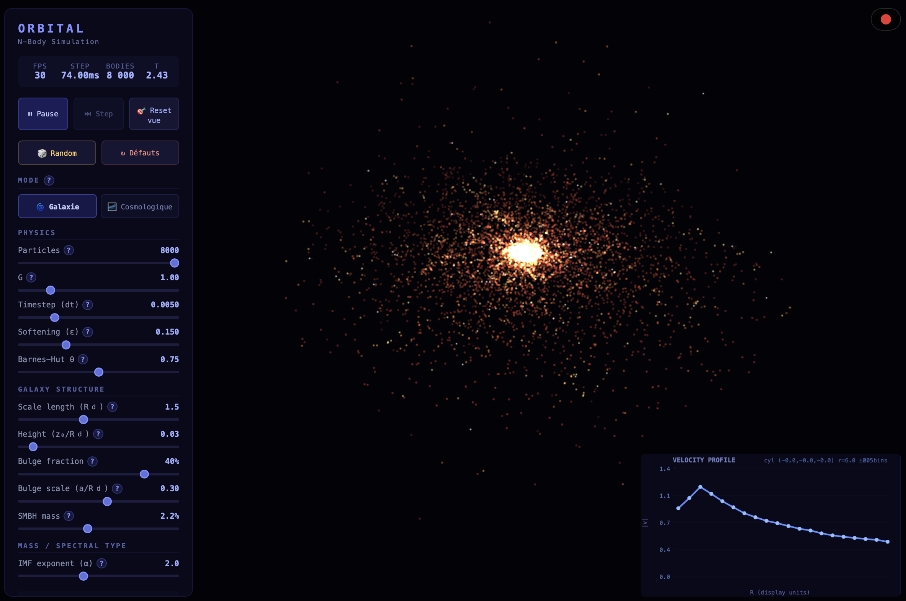

<div align="center">

# Orbital

### Real-time N-Body Galaxy Simulator

*Watch gravity sculpt galaxies, stars collapse into black holes, and dark matter shape the cosmos — all in your browser.*

[](https://vuejs.org/)
[](https://threejs.org/)
[](https://www.typescriptlang.org/)
[](LICENSE)

<br/>



</div>

---

## What is Orbital?

Orbital is a **GPU-accelerated N-body gravitational simulator** that runs entirely in the browser. It uses a Barnes-Hut octree algorithm for O(n log n) gravity calculations, Gaussian splat rendering for beautiful star visuals, and a Web Worker for non-blocking physics — all at **120 FPS** with thousands of particles.

## Features

### Physics Engine
- **Barnes-Hut Octree** — O(n log n) gravity with tunable accuracy (theta parameter)
- **Velocity Verlet** symplectic integrator for energy conservation
- **NFW Dark Matter Halo** — toggle a Navarro-Frenk-White dark matter profile with adjustable mass, scale radius, and concentration
- **Stellar Evolution** — stars age, go supernova, and collapse into stellar black holes
- **Mass Heterogeneity** — power-law IMF generates realistic star mass distributions
- **Two IC Modes** — Galaxy (disk + bulge + SMBH) or Cosmological (CMB-like structure formation)

### Rendering
- **Gaussian Splatting** — adaptive splat profiles create natural nebular glow at all zoom levels
- **Spectral Coloring** — stars colored by mass following the HR diagram (M → K → G → F → O/B)
- **SMBH Visualization** — dark core with bright accretion ring and purple outer halo
- **Supernova Flashes** — expanding spherical shockwaves on stellar death
- **Dark Matter Halo** — semi-transparent layered sphere visualization
- **Trajectory Trails** — click any particle to track its path through space
- **Video Recording** — built-in WebM capture with one click

### Interactivity
- **Click to Select** — screen-space particle picking
- **Follow Mode** — camera locks onto and orbits any particle
- **Velocity Profile** — real-time rotation curve graph with configurable measurement plane
- **Full Control Panel** — 20+ tweakable parameters with live updates
- **Reset View** — instant camera reset button

## Quick Start

```bash
# Clone the repo
git clone https://github.com/lejrimostfa/Orbital.git
cd Orbital

# Install dependencies
npm install

# Start dev server
npm run dev
```

Open [http://localhost:5173](http://localhost:5173) and enjoy the simulation.

## Controls

| Action | Input |
|---|---|
| **Rotate** | Left-click drag |
| **Zoom** | Scroll wheel |
| **Pan** | Right-click drag |
| **Select particle** | Click on a star |
| **Follow particle** | Select then enable follow mode |
| **Deselect** | Click empty space |
| **Record video** | Red circle button (top-right) |

## Tech Stack

| Layer | Technology |
|---|---|
| **Frontend** | Vue 3 + TypeScript |
| **3D Rendering** | Three.js with custom GLSL shaders |
| **Physics** | Web Worker + Barnes-Hut octree |
| **Build** | Vite |
| **Integrator** | Velocity Verlet (symplectic) |

## Architecture

```
src/
├── components/
│   ├── SimulationView.vue    # Main view + video recording
│   ├── ControlPanel.vue      # All UI controls and parameters
│   └── VelocityGraph.vue     # Real-time rotation curve chart
├── renderer/
│   └── SceneManager.ts       # Three.js scene, shaders, camera
├── simulation/
│   ├── types.ts              # Config types and defaults
│   └── useSimulation.ts      # Vue composable — worker bridge
└── workers/
    └── nbody.worker.ts       # Physics engine (octree, gravity, evolution)
```

## Performance

| Particles | FPS | Step Time | Hardware |
|---|---|---|---|
| 3,000 | 120 | ~25ms | Apple M1 Max |
| 1,000 | 120 | ~5ms | Any modern GPU |

## Contributing

Contributions are welcome! Feel free to open issues or pull requests.

## License

MIT — do whatever you want with it.

---

<div align="center">

*Built with gravity and curiosity*

</div>
